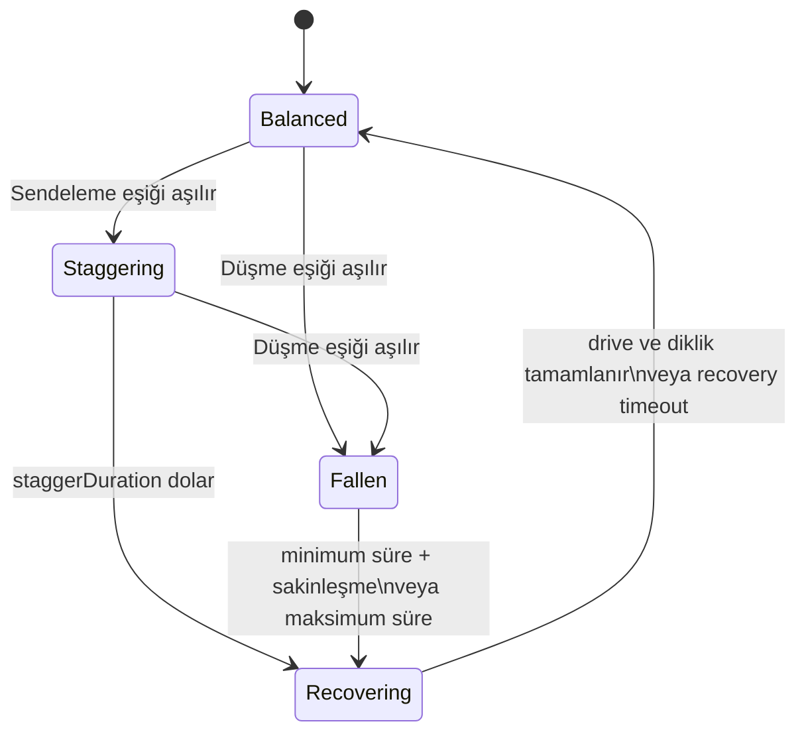
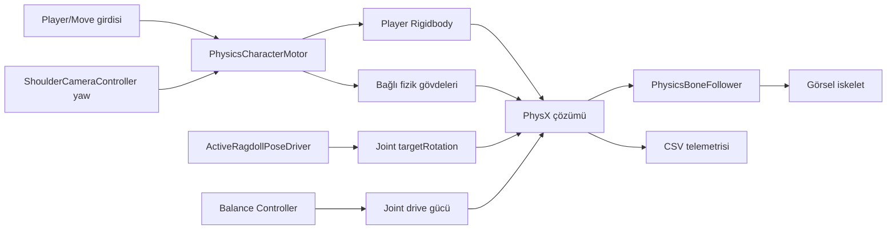

# Denge, Düşme ve Toparlanma Sistemi — Teknik Anlatım

> 2026-09-08 güncellemesi: Aşağıdaki metin ilk sistem incelemesinin tarihsel kaydıdır; sabit lift, zorla dikleştirme ve eksik kapanış hakkındaki eski bölümler güncel kodu anlatmaz. Uygulanan yeni sistem, ayarlar ve doğrulama için [RECOVERY_SMOOTHING_REVIEW.md](RECOVERY_SMOOTHING_REVIEW.md) dosyasını okuyun.

Son güncelleme: 2026-09-08  
Ana script: `Assets/Scripts/Character/PhysicsCharacterBalanceController.cs`  
Bağlı sistemler: `PhysicsCharacterMotor`, `ActiveRagdollPoseDriver`, `PhysicsBoneFollower`, `PhysicsCharacterTelemetry`

## 1. Sistemin amacı

Bu sistemin amacı karakteri sürekli gevşek bir ragdoll yapmak değildir. Normal yürüyüşte karakter oyuncunun doğrudan kontrolünde kalır; fizik gövdeleri çevreye ve darbelere tepki verir. Yeterince büyük bir bozulma olduğunda karakter önce sendeleyebilir, daha büyük bir bozulmada düşebilir ve fizik sakinleştikten sonra otomatik olarak kontrollü poza dönebilir.

Sistem dört durumu yönetir:

1. `Balanced`: Motor açıktır, joint drive'ları tam güçtedir ve karakter normal hareket eder.
2. `Staggering`: Karakter hâlâ ayaktadır fakat pose drive'ları kısa süreli zayıflatılır.
3. `Fallen`: Motor kapatılır, kökün devrilmesine izin verilir ve joint drive'ları neredeyse tamamen gevşetilir.
4. `Recovering`: Joint drive'ları kademeli geri gelir; düşüş yaşandıysa kök dik döndürülür ve bütün fizik rig'i birlikte yukarı taşınır.



## 2. Sahne mimarisi

Karakter iki ayrı yapıdan oluşur:

- `Player`: Ana hareket gövdesidir. Üzerinde `Rigidbody`, `CapsuleCollider`, `PhysicsCharacterMotor` ve denge controller'ı bulunur.
- `PhysicsRig`: Sahne kökünde ayrı duran organizasyon nesnesidir. `Player`ın child'ı değildir. Göğüs, kafa, kollar, bacaklar ve ayaklara ait fizik proxy Rigidbody'lerini barındırır.

Proxy gövdeler Transform hiyerarşisiyle değil, `ConfigurableJoint.connectedBody` bağlantılarıyla fizik zinciri oluşturur. Güncel sahnede toplam `13 Rigidbody` ve `12 ConfigurableJoint` vardır. `Player` kütlesi `12`, proxy gövdelerin toplam kütlesi yaklaşık `2.58` ve kök/proxy kütle oranı yaklaşık `4.65`tir.

`PhysicsRig` Player'ın altında olmadığı için şu çağrı yeterli değildir:

```csharp
Player.GetComponentsInChildren<ConfigurableJoint>();
```

Bu nedenle controller, Inspector'dan verilen `physicsRig` referansının altını tarar:

```csharp
joints = physicsRig.GetComponentsInChildren<ConfigurableJoint>(true);
rigBodies = physicsRig.GetComponentsInChildren<Rigidbody>(true);
```

`true`, pasif child nesnelerin de aramaya katılmasını sağlar.

## 3. Sistemlerin birbirine bağlanışı



Sorumluluklar özellikle ayrıdır:

- Motor, karakterin nereye ve hangi ivme sınırıyla hareket edeceğini belirler.
- Pose driver, uzuvların hangi yerel rotasyona ulaşmaya çalışacağını belirler.
- Balance controller, pose hedefini değiştirmek yerine bu hedefe ne kadar güçlü gidileceğini ölçekler.
- PhysX, kütle, temas, kuvvet, joint limitleri ve drive kuvvetlerinden gerçek hareketi çözer.
- Bone follower, fizik proxy rotasyonlarını render edilen iskelete aktarır.
- Telemetri, teşhis için fizik zaman çizelgesini CSV'ye yazar.

Bu ayrım sayesinde düşerken yürüyüş hedefleri üretilmeye devam etse bile çok düşük drive gücü nedeniyle ragdoll fiziksel davranabilir. Toparlanırken aynı hedefler, drive gücü yükseldikçe yeniden etkili olur.

## 4. Unity güncelleme sırası

Fizik hesapları `FixedUpdate` içinde yapılır. Denge controller'ındaki `[DefaultExecutionOrder(50)]`, varsayılan sıradaki motor ve pose driver'dan sonra çalışmasını sağlar. Telemetri `[DefaultExecutionOrder(1000)]` ile daha sonra çalışır ve o fizik adımındaki uygulanmış sonuçları kaydeder.

Genel sıra şöyledir:

1. `Update`: Kamera ve hareket girdisi okunur.
2. Motor `FixedUpdate`: Yaw, grounded durumu, step solver ve hareket ivmesi uygulanır.
3. Pose driver `FixedUpdate`: Joint hedef rotasyonları yazılır.
4. Balance controller `FixedUpdate`: Ölçümler güncellenir, state machine çalışır ve gerekirse drive gücü değiştirilir.
5. PhysX simülasyonu: Kuvvetler, temaslar, constraint'ler ve joint'ler çözülür.
6. Telemetri `FixedUpdate`: Teşhis değerleri kaydedilir.
7. `LateUpdate`: Fizik proxy'lerinin interpolasyonlu rotasyonu görsel kemiklere, kök konumu da kameraya aktarılır.

Bir eşik o fizik adımında aşılırsa motor denge controller'ından daha önce çalışmış olabileceği için düşüşün algılandığı adımda son bir motor ivmesi uygulanmış olabilir. Motor sonraki fizik adımlarında kapalıdır.

## 5. Başlangıçta alınan fizik yedekleri

`Awake()` yalnızca referans kontrolü yapmaz; sistemin daha sonra geri döneceği başlangıç durumunu kaydeder.

### Joint drive yedeği

Her `ConfigurableJoint` için üç drive saklanır:

- `angularXDrive`: Joint'in X açısal eksen sürücüsü.
- `angularYZDrive`: Y ve Z açısal eksen sürücüsü.
- `slerpDrive`: Üç ekseni birlikte hedef rotasyona götüren Slerp sürücüsü.

Bu yedekler alınmazsa düşüş sırasında drive değerleri küçültildikten sonra özgün Inspector ayarlarına güvenilir biçimde dönülemez.

### Kök constraint yedeği

Normal durumda Player'ın X ve Z rotasyonları kilitlidir; Y yönü motorun kontrollü yaw hedefidir. Güncel sahnedeki değer `80`, yani `FreezeRotationX | FreezeRotationZ` birleşimidir. Controller bu değeri `defaultRootConstraints` içinde saklar.

### Dinlenme göğüs rotasyonu

Göğsün dünyadaki mutlak rotasyonu değil, Player'a göre göreli rotasyonu saklanır:

```csharp
restChestRelativeRotation =
    Quaternion.Inverse(rootBody.rotation) * chestBody.rotation;
```

Bu sayede Player dünyada yön değiştirdiğinde normal dönüş yanlışlıkla göğüs sapması sayılmaz.

### Son kararlı ileri yön

Kökün ileri vektörü yatay düzleme izdüşürülür ve normalize edilir. Bu yön, karakter düşüp doğrultusunu kaybettiğinde hangi yöne bakarak kalkacağını belirler.

## 6. Darbe ve denge ölçümleri

Controller doğrudan `OnCollisionEnter` içindeki tek bir impulse değerine bağlı değildir. Her fizik adımında kök ile göğüs arasındaki göreli hareketi ve pozu ölçer. Böylece temasın hangi collider'da başladığından bağımsız, bütün gövde zincirindeki bozulmayı gözleyebilir.

### Göreli doğrusal hız

```text
relativeLinearSpeed = |chestVelocity - rootVelocity|
```

Birim `m/s`dir. Kök ve göğüs aynı dünya hızıyla birlikte taşınıyorsa değer küçüktür. Göğüs darbeyle kökten farklı hareket ederse büyür.

### Göreli açısal hız

```text
relativeAngularSpeed = |chestAngularVelocity - rootAngularVelocity|
```

Birim `rad/s`dir. Göğsün kökten bağımsız hızla dönmesi, bu ölçümü yükseltir.

### Göğüs poz sapması

Önce güncel göreli rotasyon hesaplanır:

```csharp
Quaternion currentChestRelativeRotation =
    Quaternion.Inverse(rootBody.rotation) * chestBody.rotation;
```

Sonra başlangıçtaki göreli rotasyon ile arasındaki en kısa açı alınır:

```text
chestDeviation = Angle(restRelativeRotation, currentRelativeRotation)
```

Birim derecedir. Bu ölçüm hız kalmadıktan sonra bile göğsün normal pozdan ne kadar uzak kaldığını gösterebilir.

### Kök eğimi

```text
rootTilt = Angle(rootUp, worldUp)
```

Birim derecedir. Mevcut kod bunu Inspector'daki canlı okumada gösterir fakat state geçişlerinde henüz kullanmaz. Dolayısıyla bu bir gözlem/gelecek ayar alanıdır; şu an düşme kararı veren dördüncü eşik değildir.

### Neden tam-rig ivmesi önemli?

Motorun locomotion ivmesi yalnız Player'a uygulanırsa göğüs ve uzuvlar bu hız değişimini joint'ler üzerinden gecikmeli alır. Bu yapay göreli hareket hem kırbaçlanma yaratır hem de denge eşiklerini yanlış tetikleyebilir.

Güncel motor aynı `ForceMode.Acceleration` değerini Player ile bütün bağlı dinamik gövdelere uygular. Böylece normal hızlanma/frenleme bütün karakteri ortak taşır; dış darbe ve uzuvların göreli hareketi ise korunur. Telemetride doğrulanan dur-kalk iyileşmesinin temeli budur.

## 7. Eşik mantığı

Sendeleme ve düşme kararları `OR` mantığıyla çalışır. Ölçümlerden yalnızca birinin eşiği aşması yeterlidir:

```csharp
relativeLinearSpeed >= threshold
|| relativeAngularSpeed >= threshold
|| chestDeviation >= threshold
```

Kod varsayılanları:

| Parametre | Varsayılan | Birim | Anlam |
| --- | ---: | --- | --- |
| `startupGraceTime` | 1.0 | saniye | Sahne yerleşirken yanlış tetiklemeyi önleyen başlangıç süresi |
| `staggerRelativeSpeed` | 1.0 | m/s | Göğüs-kök göreli hızında sendeleme eşiği |
| `fallRelativeSpeed` | 3.0 | m/s | Göğüs-kök göreli hızında düşme eşiği |
| `staggerRelativeAngularSpeed` | 3.0 | rad/s | Göreli dönüşte sendeleme eşiği |
| `fallRelativeAngularSpeed` | 7.0 | rad/s | Göreli dönüşte düşme eşiği |
| `staggerChestDeviation` | 12 | derece | Poz sapmasında sendeleme eşiği |
| `fallChestDeviation` | 30 | derece | Poz sapmasında düşme eşiği |

Bu değerler henüz kullanıcı testiyle onaylanmış denge ayarları değildir. Canlı Unity sahnesindeki controller şu anda bu varsayılanları kullanıyor ve dört referansın tamamı bağlıdır. Ancak sahne `Dirty=True` durumundadır; component ve bağlantıların diskte kalıcı olması için kullanıcının sahneyi kaydetmesi gerekir.

## 8. `Balanced` durumu

Bu durumda controller son kararlı ileri yönü sürekli günceller. `startupGraceTime` dolduktan sonra önce düşme eşiğine, sonra sendeleme eşiğine bakar. Sıralamanın düşmeyle başlaması önemlidir: aynı anda hem küçük hem büyük eşik aşılmışsa sistem önce `Staggering`e girip bir fizik adımı kaybetmez, doğrudan `Fallen`a geçer.

## 9. `Staggering` durumu

Sendeleme başladığında joint drive'ları `staggerDriveScale` ile ölçeklenir. Varsayılan `0.35`, özgün yay, damper ve maksimum kuvvetin yüzde 35'inin kullanılması demektir.

Sendeleme sırasında düşme eşiği aşılırsa tam düşüşe geçilir. Aşılmazsa `staggerDuration` dolunca, düşüşten gelmeyen recovery başlar. Bu recovery kökü çevirmez veya rig'i kaldırmaz; yalnızca drive gücünü yumuşakça `1`e döndürür.

## 10. `Fallen` durumu

Tam düşüşe girerken şu sıra izlenir:

1. Motorun daha önce açık olup olmadığı saklanır.
2. Motor kapatılır; girdi karakteri yerde sürüklemez.
3. Normal kök constraint'lerinden X ve Z rotasyon kilitleri kaldırılır.
4. Y rotasyonu kilitlenir; karakter pitch/roll ile devrilebilir fakat yerde kontrolsüz yaw dönmesi sınırlanır.
5. Joint drive'ları `fallenDriveScale` değerine indirilir. Varsayılan `0.03`, neredeyse gevşek fakat tamamen kuvvetsiz olmayan bir ragdoll üretir.

Karakterin sakinleşmesi yalnız göğüs üzerinden değil, kök ve bütün proxy Rigidbody'leri üzerinden değerlendirilir:

```text
maxLinearSpeed  = tüm gövdelerdeki en büyük |linearVelocity|
maxAngularSpeed = tüm gövdelerdeki en büyük |angularVelocity|
```

Recovery ancak `minimumFallenDuration` geçtikten sonra başlayabilir. Bundan sonra bütün gövdeler hız eşiklerinin altındaysa veya `maximumFallenDuration` dolmuşsa toparlanma başlar. Maksimum süre, sürekli küçük titreşimin karakteri sonsuza kadar yerde tutmasını önleyen güvenlik çıkışıdır.

## 11. `Recovering` durumu

Her fizik adımında drive gücü `Mathf.MoveTowards` ile `1`e yaklaşır:

```text
driveStep = fixedDeltaTime / recoveryDuration
```

Bu ifade ideal koşulda drive ölçeğinin yaklaşık `recoveryDuration` saniyede tam güce dönmesini sağlar.

### Sendelemeden toparlanma

Kök rotasyonu ve konumu değiştirilmez. Drive ölçeği `0.999` veya üstüne geldiğinde recovery bitmelidir.

### Düşüşten toparlanma

Hedef rotasyon son kararlı yatay ileri yönden üretilir:

```csharp
recoveryTargetRotation =
    Quaternion.LookRotation(lastStableForward, Vector3.up);
```

Toparlanma sırasında:

- Kök açısal hızı sıfıra doğru sönümlenir.
- Kök, `recoveryRotationSpeed` sınırıyla hedef dik rotasyona çevrilir.
- `recoveryLiftDistance`, toparlanma süresine dağıtılarak bütün rig'e uygulanır.
- Drive'lar kademeli olarak tam güce çıkar.

Yalnız Player'ı yukarı taşımak joint'leri gerip uzuvları geride bırakacağı için `MoveWholeRigUp`, Player ve `physicsRig` altındaki bütün Rigidbody'leri aynı displacement ile taşır.

Normal bitiş koşulu üç şartın birlikte sağlanmasıdır:

- En az `recoveryDuration` geçmiş olmalı.
- Drive ölçeği tam güce ulaşmış olmalı.
- Kök rotasyonu hedef dik poza `uprightTolerance` kadar yaklaşmış olmalı.

`maximumRecoveryDuration` yine güvenlik çıkışıdır. Normal koşullar sağlanamazsa sistem sonsuza kadar recovery'de kalmamalıdır.

## 12. Recovery sonunda motorun güvenli geri verilmesi

Düşüşten recovery bittiğinde kök hedef rotasyona kesin olarak oturtulur, açısal hız sıfırlanır ve başlangıç constraint'leri geri yüklenir.

Motor kapalıyken kendi `controlledYaw` alanında düşüş öncesindeki hedefi tutar. Motor doğrudan yeniden açılırsa ilk fizik adımında gövdeyi eski yaw'a çevirmeye çalışabilir. Bu nedenle önce:

```csharp
motor.SynchronizeControlledYawToBody();
```

çağrılır. Motorun gizli yaw hedefi, toparlanmış Rigidbody'nin güncel Y açısıyla eşitlenir. Motor yalnızca düşmeden önce açıksa yeniden açılır.

Son olarak drive ölçeği tam güce alınmalı, `recoveringFromFall` temizlenmeli, state `Balanced` yapılmalı ve son kararlı yön yenilenmelidir.

## 13. Joint drive ölçekleme fiziği

`JointDrive` üç temel sayı taşır:

- `positionSpring`: Hedef rotasyondan sapmaya karşı düzeltme sertliği.
- `positionDamper`: Dönüş hızını sönümleyerek salınımı azaltan direnç.
- `maximumForce`: Drive'ın uygulayabileceği üst kuvvet/tork sınırı.

Controller üçünü de aynı katsayıyla çarpar:

```csharp
source.positionSpring *= scale;
source.positionDamper *= scale;
source.maximumForce *= scale;
```

`scale = 1` Inspector'daki özgün karakter sertliğini, `0.35` daha yumuşak sendelemeyi, `0.03` ise neredeyse ragdoll davranışını temsil eder. Her değişiklik başlangıç yedeğinden hesaplanır; bir önceki küçültülmüş değerin tekrar küçültülmesiyle üstel değer kaybı oluşmaz.

Joint `rotationDriveMode` ayarına göre Slerp veya X/YZ sürücüleri aktif olabilir. Bu yüzden üç sürücünün de doğru yedeklenmesi gerekir.

## 14. Inspector referansları

Controller'ın `References` bölümündeki dört alanın görevi şöyledir:

| Alan | Bağlanacak nesne | Neden gerekli? |
| --- | --- | --- |
| `Root Body` | `Player` Rigidbody | Denge ölçümü, constraint, düşüş rotasyonu ve recovery hareketinin ana gövdesi |
| `Chest Body` | `ChestPhysics` Rigidbody | Köke göre darbe hızı, açısal hız ve poz sapmasının sensörü |
| `Physics Rig` | Sahne kökündeki `PhysicsRig` Transform | Bütün joint ve proxy gövdelerini bulmak, drive ölçeklemek ve rig'i birlikte kaldırmak |
| `Motor` | Player'daki `PhysicsCharacterMotor` | Düşerken kontrolü kapatmak, recovery sonunda yaw'ı eşitlemek ve kontrolü geri vermek |

Controller'daki bütün serialize Inspector alanlarına kod içinde Tooltip eklendi. Referansların görevi; eşiklerin birimi ve tetiklediği davranış; süre, drive ve recovery ayarlarının etkisi; debug değerlerinin uyguladığı hız değişimi ve `Live Readout` alanlarının yalnız izleme amacı taşıdığı doğrudan Inspector'da açıklanır.

2026-09-08 canlı Unity kontrolünde bağlantılar `Root Body = Player`, `Chest Body = ChestPhysics`, `Physics Rig = PhysicsRig`, `Motor = Player üzerindeki motor` olarak doğrulandı. Bu kontrol salt okunur yapıldı; sahne Codex tarafından kaydedilmedi.

## 15. Debug araçları

Component bağlanıp Play moduna geçildikten sonra Inspector component menüsünde iki komut vardır:

- `Debug/Force Stagger`: State'i doğrudan `Staggering` yapar ve göğse ileri yönde `VelocityChange` uygular.
- `Debug/Force Fall`: State'i doğrudan `Fallen` yapar ve köke sağ eksen çevresinde `VelocityChange` torku uygular.

`ForceMode.VelocityChange`, kütleden bağımsız doğrudan hız değişimi ürettiği için debug kuvvetleri farklı kütle ayarlarında daha tekrarlanabilir olur. Bunlar gerçek oynanış darbe sistemi değildir; state akışını kontrollü test etmek içindir.

## 16. Mevcut kod karşılaştırmasının bulguları

Elle yazılan sürüm genel mimariyi doğru kuruyor: state machine, göreli ölçümler, bütün rig'i bulma, drive ölçekleme, düşüş constraint'leri, sakinleşme kontrolü, rig'i birlikte kaldırma ve motor yaw senkronizasyonu doğru yönde yazılmış.

Ancak testten önce düzeltilmesi gereken iki işlevsel fark vardır.

### 16.1 `angularYZDrive` yanlış yedekleniyor

Mevcut satır:

```csharp
angularYZ = joint.angularXDrive;
```

Olması gereken:

```csharp
angularYZ = joint.angularYZDrive;
```

Mevcut haliyle controller, YZ drive'ına özgün YZ değerleri yerine X drive değerlerini yazar. Slerp kullanan joint'lerde etkisi gizli kalabilir; `XAndYZ` modunda ise Y/Z sertliği ve geri yükleme değeri yanlış olur.

### 16.2 `FinishRecovery()` kapanışı eksik

Metodun düşüşe özel `if` bloğundan sonra şu ortak kapanış bulunmalıdır:

```csharp
ApplyDriveScale(1f);
recoveringFromFall = false;
SetState(BalanceState.Balanced);
UpdateLastStableForward();
```

Bu satırlar olmadan:

- Sendelemeden recovery hiçbir zaman `Balanced`a dönmez.
- Düşüşten recovery motoru geri açabilse bile state `Recovering` olarak kalır.
- `TickRecovering()` her fizik adımında yeniden bitiş çağrısı yapar.
- Yeni darbe algılama akışı tekrar başlamaz.

### 16.3 İşlevsel olmayan farklılıklar

- Script global namespace'tedir; diğer karakter scriptleri `RagdollDemo.Character` namespace'indedir. `using RagdollDemo.Character` sayesinde derlenir fakat proje düzeniyle tutarlı değildir.
- `System`, `System.Runtime.CompilerServices`, `Unity.AppUI.Editor`, `Unity.VisualScripting`, `UnityEngine.EventSystems` ve `UnityEngine.InputSystem.iOS` bu scriptte kullanılmıyor. Mevcut projede derlemeyi bozmadılar; yine de gereksiz bağımlılıklardır. Bu controller için yalnız `using UnityEngine;` yeterlidir.
- Girinti ve boşluk farkları çalışmayı değiştirmez.
- `rootTilt` ölçülüyor fakat karar mantığında kullanılmıyor. Bu mevcut tasarım davranışıdır, yazım hatası değildir.

## 17. Güvenlik sınırları ve mevcut kısıtlar

- Bu sistem animasyonlu veya temas farkındalıklı gerçek bir ayağa kalkma hareketi değildir; kökü döndürür, bütün rig'i kaldırır ve drive'ları geri getirir.
- Tavan veya dar bir yüzey altında recovery için boşluk kontrolü yapılmaz.
- Recovery sırasında kapsülün/uzuvların çevreyle sıkışmasını önleyen overlap testi yoktur.
- Ön/arka düşüşe göre ayrı recovery pozu yoktur.
- Havada özel pose hedefi yoktur.
- Darbe kaynağı, temas noktası veya impulse kaydedilmez; göğüs-kök göreli bozulması ölçülür.
- Eşiklerde hysteresis yoktur; state süreleri tekrar tetiklemeyi dolaylı olarak sınırlar.
- `rootTilt` henüz düşme koşulu değildir.
- Yeni controller ve dört referans canlı sahnede bağlıdır; fakat sahne şu anda kaydedilmemiş değişiklik taşıyor (`Dirty=True`). Unity kapanmadan önce bu kullanıcı değişikliğinin kaydedilmesi gerekir.

## 18. Önerilen ilk test sırası

Kodun iki işlevsel farkı düzeltildikten sonra testleri tek tek yapmak teşhisi kolaylaştırır. Dört referans canlı sahnede zaten bağlıdır:

1. Play başlangıcı: İlk bir saniyede yanlış sendeleme/düşme olmamalı.
2. `Debug/Force Stagger`: `Balanced → Staggering → Recovering → Balanced` sırası görülmeli; motor kesilmemeli.
3. `Debug/Force Fall`: `Balanced → Fallen → Recovering → Balanced` sırası görülmeli.
4. Düşüş sırasında WASD: Motor kapalı olduğu için Player kontrollü yürümemeli.
5. Recovery sonu: Karakter son kararlı yöne bakmalı; eski yaw hedefine sıçramamalı.
6. Normal yürüyüş: Ani başlama, frenleme, dönüş, rampa ve basamak normal hareket sırasında eşikleri yanlış tetiklememeli.
7. Dış kuvvet: Küçük darbe sendeleme, daha büyük darbe düşme üretebilmeli.
8. Çevre sıkışması: Recovery sırasında uzuvlarda aşırı hız, joint ayrışması veya fizik patlaması olmamalı.

Test sonucu paylaşılırken şu bilgiler özellikle yararlıdır:

```text
Test:
State sırası:
Beklenen davranış:
Görülen davranış:
Live Readout tepe değerleri:
Console hata/uyarı:
Varsa video veya Diagnostics CSV adı:
```

## 19. Kaynak dosya haritası

| Dosya | Görevi |
| --- | --- |
| `PhysicsCharacterBalanceController.cs` | Denge state machine'i, darbe ölçümü, drive ölçekleme, düşüş ve recovery |
| `PhysicsCharacterMotor.cs` | Kamera yönünde hareket, kontrollü yaw, ground kontrolü, step solver ve full-rig acceleration |
| `ActiveRagdollPoseDriver.cs` | Dinlenme pozu, ileri/geri gait ve yanal adım joint hedefleri |
| `PhysicsBoneFollower.cs` | Fizik proxy rotasyonlarını görsel iskelete offset koruyarak aktarır |
| `PhysicsCharacterTelemetry.cs` | Input, ivme, gövde hızları, göreli açı/açısal hız ve kamera farkını CSV'ye kaydeder |
| `ShoulderCameraController.cs` | Mouse bakışı, omuz kadrajı, cursor lock ve kamera çarpışması |

## 20. Kısa teknik özet

Bu controller bir animasyon seçici değil, fizik sertliğini yöneten bir state machine'dir. Darbeyi göğüs ile kök arasındaki göreli hız ve poz bozulmasından çıkarır. Sendelemede joint drive'larını geçici azaltır. Düşüşte motoru kapatıp kökün pitch/roll eksenlerini serbest bırakır. Rig sakinleştiğinde bütün gövdeleri birlikte kaldırır, kökü son kararlı yöne döndürür, drive'ları geri getirir ve motorun yaw hedefini yeni fizik pozuyla senkronize eder. Sistemin kararlılığı, locomotion ivmesinin tüm bağlı gövdelere eşit uygulanmasına ve recovery sonunda state/drive/constraint/motor değerlerinin eksiksiz geri yüklenmesine bağlıdır.
